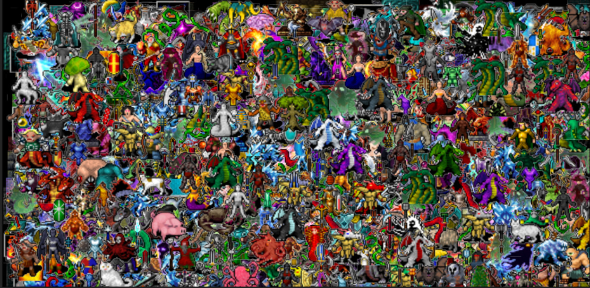

# Fast WebGL2 sprites

## Install

This will create a "websprite" directory
in the current directory.
```
git clone https://github.com/doug65536/websprite.git
cd websprite
npm install
npm start
```

Use one of the links in the output to open the page.

The test renders 3072 sprites moving randomly.

## Code

It uses an SoA format to pack the instance data in a data oriented
SIMD-friendly layout.

You load one big atlas texture for all of the sprites.

Each sprite is described by:

| Variable   | Meaning                  |
|------------|--------------------------|
| dx, dy, dz | Position                 |
| dw, dh     | Output size              |
| sx, sy     | Source position in atlas |
| sw, sh     | Size of sprite in atlas  |

- You can give a different dw,dh than sw,sh and it will scale it
- You can make every sprite start at an arbitrary position in the atlas
- You can make every sprite a different size
- You can make the dw and/or dh zero and that sprite will not be drawn

In javascript, the SoA class holds the instance data and manages
formatting the data for optimal SIMD performance, and performs GPU uploads

You can adjust the parameters for sprite `i` by:

```
instances.set(i, {
    dx: 42,
    dy: 84
});
```

As long as you eventually call

```
instances.upload();
```

before you render.

See the [demo.js](https://github.com/doug65536/websprite/blob/main/demo.js)
for an example.

## Art

Credit: [https://opengameart.org/content/dungeon-crawl-32x32-tiles-supplemental](https://opengameart.org/content/dungeon-crawl-32x32-tiles-supplemental)

It was 2048x1536, I adjusted it to 2048x2048 and extended the code to
take the usable area in the config file. WebGL2 does not support
sampler2DRect (surprisingly!). Not even on RTX 2060 Super.

## Demo/Stress

